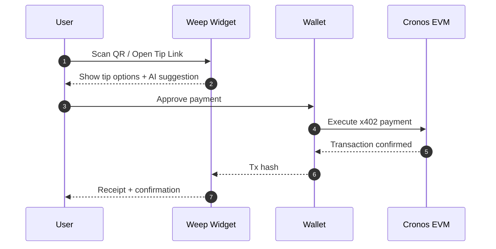
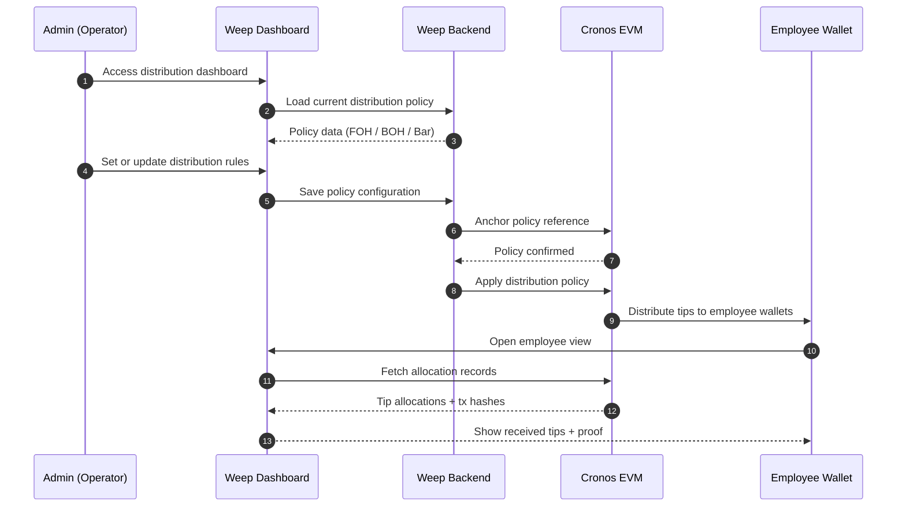
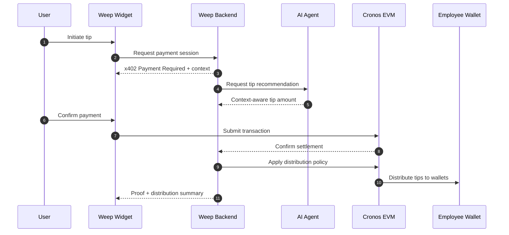

# Weep

**AI-native, x402-powered tipping infrastructure for global service businesses**

Weep is not a payment app or a wallet.
It is a programmable tipping infrastructure that enables transparent, automated, and trust-enforced tipping workflows for restaurants, hotels, mobility platforms, and other service businesses.

Built on **Cronos EVM**, Weep combines **consumer-facing x402 flows**, **AI-driven decision logic**, and **on-chain programmatic settlement** to turn tipping into an executable, scalable on-chain action.

## Why Weep

Tipping has become a core compensation and experience layer in the global service economy.
However, existing systems treat tipping as a UI feature rather than infrastructure.

This leads to:

* Opaque tip distribution and employee distrust
* Manual policies and frequent internal disputes
* No standardization across regions and cultures
* Tip data being unused for operations or retention
* No support for AI-initiated or automated tipping flows

**Weep addresses this by redefining tipping as infrastructure, not a button.**

## What Weep Does

Weep manages the full lifecycle of tipping:

* How tips are initiated
* How they are distributed
* How trust is enforced
* How intelligence is applied
* How data is used operationally

It enables both **humans and AI agents** to interact with tipping in a programmable, verifiable way.

## Core Features

### 1. Embeddable Tipping Widget (x402)

* QR codes, tip links, and web widgets
* x402 `Payment Required` responses
* Wallet used only for authentication and settlement
* No sign-ups or app installs required

### 2. Distribution & Trust Layer

* POS-style distribution dashboard
* Configurable policies (FOH / BOH / Bar)
* Direct payouts to individual employee wallets
* Verifiable, tamper-resistant records

### 3. AI-Powered Tipping Intelligence

* Country-specific tipping culture analysis
* Context-aware tip recommendations
* Reduced decision fatigue for users
* AI agents can initiate and manage tipping flows

## Layered Architecture

Weep is designed as a layered infrastructure:

```
Layer 4. Insight & Compliance
- Analytics, reporting, compliance-ready data

Layer 3. Intelligence & Recommendation
- AI-driven tip suggestions and context analysis

Layer 2. Distribution & Trust
- Policy-based distribution, employee wallets, verifiable records

Layer 1. Tip Initiation
- Widgets, QR, x402 flows, wallet-based settlement
```

Each layer solves a distinct problem, and together they form a complete tipping infrastructure.

## User Flow (End User Perspective)



**Goal:**
Enable frictionless tipping in 2–3 steps without sign-ups or app installs.

## Admin & Employee Unified Flow (Distribution & Trust)



**Weep separates responsibilities by design:**
- Admins define distribution policies without touching funds
- Employees receive and verify tips directly in their own wallets
- The protocol enforces trust through on-chain settlement

## Weep Flow (Infrastructure & Trust Perspective)



**Goal:**
Enforce trust, ownership, and transparency through programmatic settlement.

## Vision

**To become the invisible, programmable tipping infrastructure that lets value flow transparently and globally between people and AI.**

### Notes
* Wallets are used strictly for authentication and settlement, not as UX
* Trust is enforced by structure, not promises
* Weep is designed as infrastructure-first, UI-second
